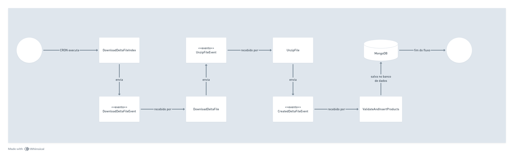

# Open Food Facts backend

## Descrição
Este é um projeto NestJS que visa aplicar os conhecimentos para a vaga de desenvolvedor fullstack pleno.

### Features
- Listagem de produtos
- Alterar um produto
- Detalhes de um produto
- Remover um produto

### Tecnologias
- [NestJS](https://nestjs.com/)
- [MongoDB](https://www.mongodb.com/)
- [Jest](https://jestjs.io/pt-BR/)
- [Swagger](https://swagger.io/)

## Instalação
Siga os passos abaixo para configurar localmente.

## Pré-requisitos
A versão do NodeJS utilizada neste projeto foi a v20.18.0.

## Iniciando projeto

1. Para iniciar a aplicação usando docker compose localmente, siga os passos abaixo
2. Crie um arquivo `.env` baseado no `.env.example`
```bash
cp .env.example .env
```
3. Execute a aplicação
```bash
docker compose up
```
4. A aplicação está pronta para responder

### O arquivo .env
Alguns pontos importantes ao adicionar as variáveis de ambiente
- IMPORT_PRODUCTS_CRON: essa variável deve estar entre aspas pois contém espaços em branco
  devido ao cron, logo ela deve estar desta forma `IMPORT_PRODUCTS_CRON="0 16 * * *" // todo dia as 16 horas`
- ITEMS_TO_IMPORT_PER_FILE: essa variável é um inteiro, que pode ser configurado para a quantidade máxima de produtos importados por arquivo
- URL_DELTA_INDEX: variável contendo a url com os arquivos a serem importados por exemplo `URL_DELTA_INDEX=https://static.openfoodfacts.org/data/delta/index.txt`
- URL_DELTA_FILE_DOWNLOAD: essa variável deve conter a url para download dos arquivos apontados no delta_index, sem o path que é inserido o nome do arquivo, por exemplo `URL_DELTA_FILE_DOWNLOAD=https://static.openfoodfacts.org/data/delta` 
- URL_DELTA_FILE_DOWNLOAD: variável com o path para download dos arquivos, lembrando que o caminho deve existir previamente, por exemplo `DOWNLOAD_DELTA_FILE_PATH=/tmp/delta-files`

### Definição de API
Para acessar a definição de API, pode-se utilizar o endpoints `/api` para visualizar a documentação swagger da API

## Estrutura do Projeto
```bash
.
├── docker-compose.yaml
├── Dockerfile
├── src
│   ├── domain
│   │   ├── common
│   │   │   ├── base                                            # Classes bases para DDD, tais como entity e value object
│   │   │   └── types                                           # Tipos comuns que serão usados pela aplicação
│   │   └── Product
│   │       ├── model                                           # Modelos de classe
│   │       ├── provider                                        # Interfaces externas para acesso a recursos
│   │       └── usecases                                        # Casos de uso da aplicação
│   └── external                                                      # Referente à camada externa no clean code, tais como http e banco de dados, onde o domínio é consumido
│       ├── common                                                    # Tipos comuns utilizados na camada externa tais como UnityOfWork
│       │   └── base
│       ├── Cron                                                      # Módulo que irá iniciar os serviços baseados em padrões CRON
│       ├── Database                                                  # Configurações de banco de dados da aplicação
│       ├── Endpoints                                                 # Endpoints da API 
│       │   ├── Health
│       │   └── Products
│       ├── Pipelines                                                 # Pipelines de fluxos, por exemplo a importação de arquivos para a base de dados
│       │   ├── events
│       │   └── pipes
│       └── Repository                                                # Implementações concretas de repositórios da camada de domínio
```

## Considerações

### Pipelines
Abaixo está uma grafo de execução de como funciona o pipeline de importação de arquivos

A ideia é tentar deixar o fluxo menos acoplado entre os passos para possíveis extensões e manutenção


### Melhorias
- Adicionar envio de logs no projeto
- Adicionar testes unitários para a camada externa
- Adicionar testes e2e nos endpoints da aplicação

### Estrutura


A estrutura do projeto é projetada para garantir uma clara separação entre a **camada de regras de negócio** e a **camada externa**, que está sujeita a constantes mudanças ao longo do tempo. 
Isso nos permite evoluir a aplicação em termos de novas tecnologias e ferramentas sem comprometer a manutenibilidade do código, evitando complexidades desnecessárias.

>  This is a challenge by [Coodesh](https://coodesh.com/)
